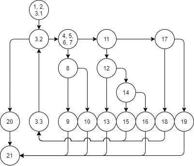

# Втора лабораториска вежба по Софтверско инженерство
## Никола Смилески, бр. на индекс 193265

### Control Flow Graph

### Цикломатска комплексност
Цикломатската комплексност на кодот е 8. За определување на цикломатската комплексност ја користам формулата E-V+2. E = 24 и V = 18 и добиваме цикломатска комплексност E-V+2 = 24-18+2 = 8

### Тест случаи според критериумот Multiple Condition
Според Multiple Condition критериумот треба да се напишат тестови кои за секој сложен услов за разгранување ќе го тестираат секое можно време на терминирање со сигурен резултат предизвикано од Lazy Evaluation на условите. Сложените услови и соодветните состојби за терминирање при Lazy Evaluation се следните:

   *     if (hr < 0 || hr > 24) // јазол 7
         TX {(-1, 0, 0)} //runtime error
         FT {(25, 0, 0)} //runtime error
         FF {(19, 06, 37)}
   *     if (min < 0 || min > 59) // јазол 12
         TX {(0, -1, 0)} //runtime error
         FT {(0, 60, 0)} //runtime error
         FF {(19, 06, 37)}
   *     if (sec >= 0 && sec <= 59) // јазол 14
         FX {(0, 0, -1)} //runtime error
         TF {(0, 0, 60)} //runtime error
         TT {(19, 06, 37)}
   *     else if (hr == 24 && min == 0 && sec == 0) // јазол 17
         TFX {(24, 1, 0)} //runtime error
         TTF {(24, 0, 1)} //runtime error
         TTT {(24, 0, 0)}
   
   Минималниот број на тестови е 9

### Тест случаи според критериумот Every Branch
За група тестови кои го задоволуваат Every Branch критериумот потребно е секое ребро од Control Flow графот да биде покриено со минимален број на тестови. Да забележиме дека темето 21 од графот има 6 влезни ребра и ниту едно излезно ребро. Ова ни помага да заклучиме дека минималниот број на тестови кои го задоволуваат овој критериум изнесува 6. Една таква група тестови е следната:
   *   {(19, 06, 37), (24, 0, 0)}
   *   {(-1, 0, 0)}
   *   {(25, 0, 0)}
   *   {(0, -1, 0)}
   *   {(0, 0, -1)}
   *   {(24, 0, -1)}
   
   Во следната [табела](everyBranch.xlsx) се прикажани ребрата кои секој од горенаведените тестови ги покрива.

### Објаснување на напишаните unit tests
Тестовите според критериумите Multiple Condition и Every Branch соодветно се имплементирани во `@Test` анотираните функции `multipleConditionTests()` и `everyBranchTests()`.
Двете функции создаваат инстанца од `SILab2` класата, за која што потоа ја тестираат функцијата `function()`. 
За полесен повик се поставени двете класи `createList()` за креирање листи и `getTime()` за добивање инстанци од класата `Time`.
Користени се `assertEquals()` и `assertThrows()` за да се проверат резултатите од извршувањата. Дополнително за секое `assertThrows()` е проверено дали се добива соодветната порака.

На крај може да забележиме дека со овие тестови целосно се задоволени критериумите, а сепак тестовите паѓаат. Значи тестовите успешно ги искористивме за да пронајдеме грешка во програмата.

